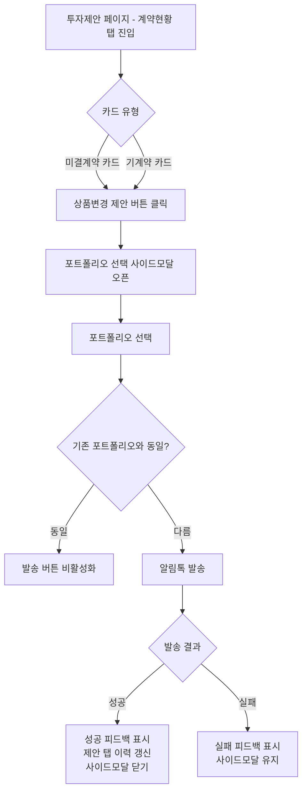

# 투자제안 알림톡 — 상품변경 지원

> 함께 작업: 1158 계약목록
> 인터뷰 상세: `INTERVIEW.md`

## 1. 사용자 스토리

FA(금융 어드바이저)로서,
미결계약 또는 기계약 상태인 고객에게 상품 변경을 위한 알림톡을 발송할 수 있다.
이를 통해 고객 리마인드를 강화하고, 능동적인 상품 변경 제안을 유도하는 도구로 활용한다.

## 2. 기능 요구사항

### 미결계약 UI 신설

- 계약현황 탭에 미결계약 카드를 새로 표시해야 한다
- 미결계약 카드는 계좌유형, 계약유형, 포트폴리오명, 진행단계, 미결 생성일을 표시해야 한다
- 계좌유형 단위 그룹에 표시할 카드(미결·기계약)가 0건이면 해당 그룹 자체를 숨겨야 한다
- 전체 카드가 0건이면 기존 EmptyView를 표시해야 한다
- 만료까지 남은 일수(D-N) 표시는 백엔드에서 삭제 예정일 필드를 제공한 이후에 구현한다

### 상품변경 제안 진입

- 미결계약 카드와 기계약 카드 각각에 상품변경 제안을 시작할 수 있는 버튼이 있어야 한다
- 버튼 클릭 시 포트폴리오 선택 사이드모달이 열려야 한다
- 기계약 카드에서 사이드모달 열면 현재 운용 중인 포트폴리오를 사이드모달 내에 표시해야 한다
- 미결계약 카드에서 사이드모달 열면 현재 제안 중인 포트폴리오를 사이드모달 내에 표시해야 한다
- 해지가 진행중인 계약에는 상품변경 버튼이 노출되지 않아야 한다

### 알림톡 발송

- 포트폴리오를 선택하고 발송하면 상품변경 알림톡이 전송되어야 한다
- 발송 시 해당 계약의 식별 정보가 함께 전달되어야 한다 (백엔드 API 협의 필요)
- 발송 성공 시 성공 피드백을 표시해야 한다
- 발송 성공 후 포트폴리오 실행 탭의 발송 이력이 갱신되어야 한다
- 기존 신규 제안(포트폴리오 실행 탭) 발송 동작은 변경되지 않아야 한다

## 3. 화면 흐름

### 3.1 화면 네비게이션 다이어그램



### 3.2 계약현황 탭 레이아웃 — 시안

#### 시안 B: 계약현황 탭의 각 카드에 상품변경 버튼 추가

```
[ 포트폴리오 실행 │ 포트폴리오 실행 │ 계약 현황 ]

▶ 계약 현황 탭

IRP
  ┌─────────────────────────────────────────┐
  │ [미결] 포트폴리오A   D-3   3/7 서명완료       │
  │                          [상품변경 제안]   │
  └─────────────────────────────────────────┘

ISA
  ┌─────────────────────────────────────────┐
  │ [기계약] 포트폴리오B   운용 중                │
  │                          [상품변경 제안]    │
  └─────────────────────────────────────────┘

연금저축
  ┌─────────────────────────────────────────┐
  │ [미결] 포트폴리오C   D-10                   │
  │                          [상품변경 제안]    │
  └─────────────────────────────────────────┘
  ┌─────────────────────────────────────────┐
  │ [기계약] 포트폴리오D   운용 중                │
  │                          [상품변경 제안]    │
  └─────────────────────────────────────────┘
```

> 계좌유형 단위로 그룹핑하여, 한 계좌유형 내 미결/기계약 카드가 순차 표시됨 (연금저축·종합위탁은 동시 존재 가능)
> 현재 3탭 구조 유지, 기존 UI 변경 최소화

---

### 3.3 선택된 시안 B의 상세 구조

```
┌─────────────────────────────────────────────────────────┐
│  [ 포트폴리오 실행 │ 포트폴리오 실행 │ 계약 현황 ]        │
├─────────────────────────────────────────────────────────┤
│                                                         │
│  IRP · 자문                                             │
│  ┌─────────────────────────────────────────┐            │
│  │ [미결] 포트폴리오A                        │            │
│  │ 제안일 2026-04-10                        │            │
│  │ [진행단계 배지]                          │            │
│  │                         [상품변경 제안]   │            │
│  └─────────────────────────────────────────┘            │
│                                                         │
│  ISA · 자문                                             │
│  ┌─────────────────────────────────────────┐            │
│  │ [기계약] 포트폴리오B                      │            │
│  │ 평가금액 / 수익률 / 계약기간 / 만료일      │            │
│  │ [운용 상태 배지]                         │            │
│  │                         [상품변경 제안]   │            │
│  └─────────────────────────────────────────┘            │
│                                                         │
│  연금저축 · 일임                                         │
│  ┌─────────────────────────────────────────┐            │
│  │ [미결] 포트폴리오C                        │            │
│  │                         [상품변경 제안]   │            │
│  └─────────────────────────────────────────┘            │
│  ┌─────────────────────────────────────────┐            │
│  │ [기계약] 포트폴리오D                      │            │
│  │                         [상품변경 제안]   │            │
│  └─────────────────────────────────────────┘            │
│                                                         │
└─────────────────────────────────────────────────────────┘
```

> 계좌유형(IRP·자문 / ISA·자문 / 연금저축·일임 / 종합위탁·일임) 단위로 그룹핑.
> 한 그룹 내 미결 + 기계약 카드가 순차 표시 (연금저축·종합위탁만 동시 존재 가능).
> 해당 계좌유형의 카드가 0건이면 그룹 자체를 숨김.
> 전체 카드 0건이면 기존 EmptyView 표시.

### 3.4 화면별 상세

#### 계약현황 탭 — 계좌유형 그룹

- 그룹 소제목: 계좌유형·계약유형 (예: `IRP·자문`, `ISA·자문`, `연금저축·일임`, `종합위탁·일임`)
- 그룹 내 카드 표시 순서: 미결계약 → 기계약
- 그룹 내 카드가 0건이면 해당 그룹 자체를 숨김

#### 계약현황 탭 — 미결계약 카드

- 카드 구성 필드:

  | #   | 필드               | 내용                        | 비고                                    |
  | --- | ------------------ | --------------------------- | --------------------------------------- |
  | 1   | 상태 표시          | `[미결]` 구분자             |                                         |
  | 2   | 포트폴리오명       | MP명                        |                                         |
  | 3   | 미결 생성일        | `YYYY-MM-DD`                |                                         |
  | 4   | 진행단계 배지      | 고객 앱 계약 진행 단계 표시 | `contractState` 기준                    |
  | 5   | 상품변경 제안 버튼 | 카드 하단 우측              | 클릭 시 포트폴리오 선택 사이드모달 오픈 |

- 만료일 관련 필드(D-N)는 이번 scope 제외. 백엔드 삭제 예정일 필드 제공 후 후속 작업.

#### 계약현황 탭 — 기계약 카드

- 기존 `ContractItem` 구성 유지 (평가금액, 수익률, 계약기간, 만료일 등)
- 추가 사항:

  | #   | 필드               | 내용                  | 비고                                    |
  | --- | ------------------ | --------------------- | --------------------------------------- |
  | 1   | 상품변경 제안 버튼 | 카드 하단에 신규 배치 | 클릭 시 포트폴리오 선택 사이드모달 오픈 |

- 해지완료 상태 계약은 카드 자체 미노출 (기존 정책 유지)
- 해지 진행중 상태 계약은 카드는 표시하되, 상품변경 제안 버튼은 표시하지 않음

#### 포트폴리오 선택 사이드모달 — 상품변경 진입점

- 오픈 트리거: 미결계약·기계약 카드의 상품변경 제안 버튼
- 사이드모달 구성:
  - 상단:
    - 발송 대상 계약 컨텍스트 (계좌유형·계약유형)
    - 현재 포트폴리오명 표시
      - 기계약에서 진입한 경우 → "현재 운용 중 포트폴리오: {MP명}"
      - 미결계약에서 진입한 경우 → "현재 제안 중인 포트폴리오: {MP명}"
    - 포트폴리오 목록: 선택 가능한 MP 리스트
  - 중단: 선택한 포트폴리오 상세 정보
  - 하단: **알림톡 발송** CTA 버튼
- 버튼 활성화 조건: 현재 선택한 포트폴리오가 기존 포트폴리오(운용중/제안중)와 다른 경우

#### 발송 결과 처리

- 성공 시
  - 성공 피드백 (기존 신규 제안과 동일 — "권유 링크를 발송했습니다." 토스트/다이얼로그)
  - 사이드모달 자동 닫기
  - 포트폴리오 실행 탭의 발송 이력 API 재조회
  - 계약현황 탭은 재조회하지 않음 (고객이 앱 진입해야 미결계약 생성됨 — 페이지 재진입 시 자연 반영)
- 실패 시
  - 실패 피드백 표시
  - 사이드모달 유지 (사용자가 재시도 가능)

## 4. 인수 조건

**미결계약 표시**

- [ ] 특정 계좌유형에 미결계약이 1건 이상이면, 해당 계좌유형 그룹 내에 미결계약 카드가 표시되어야 한다
- [ ] 미결계약 카드에 계좌유형, 계약유형, 포트폴리오명, 진행단계, 미결 생성일이 표시되어야 한다
- [ ] 특정 계좌유형 그룹에 표시할 카드(미결·기계약)가 0건이면, 해당 그룹이 표시되지 않아야 한다
- [ ] 전체 카드가 0건이면, 기존 EmptyView가 표시되어야 한다
- [ ] 연금저축 또는 종합위탁에 미결계약과 기계약이 동시에 존재하면, 같은 계좌유형 그룹 내에 미결/기계약 카드가 각각 별도로 표시되어야 한다

**상품변경 진입**

- [ ] 미결계약 카드에서 상품변경 버튼을 클릭하면, 포트폴리오 선택 사이드모달 열려야 한다
- [ ] 기계약 카드에서 상품변경 버튼을 클릭하면, 현재 운용 중인 포트폴리오가 표시된 사이드모달 열려야 한다
- [ ] 해지가 진행중인 계약에는 상품변경 버튼이 표시되지 않아야 한다
- [ ] 현재 선택한 포트폴리오가 기존 포트폴리오(운용중/제안중)와 같은 경우, 발송 버튼이 비활성화되어야 한다

**알림톡 발송**

- [ ] 포트폴리오를 선택하고 발송하면, 해당 계약 식별 정보가 포함된 알림톡이 전송되어야 한다
- [ ] 발송에 성공하면, 성공 피드백이 표시되어야 한다
- [ ] 발송에 실패하면, 실패 피드백이 표시되어야 한다
- [ ] 발송 성공 후, 포트폴리오 실행 탭의 발송 이력이 갱신되어야 한다

**기존 동작 보호**

- [ ] 포트폴리오 실행 탭의 신규 발송 동작이 변경되지 않아야 한다

## 5. 제약 조건 체크리스트

- [ ] 정책서에 개발 코드·API 엔드포인트·요청/응답 형식 포함하지 않았는가
- [ ] PII·고객 데이터가 포함되지 않았는가
- [ ] 관련 기존 정책서와 충돌하는 내용은 없는가
- [ ] 미결계약 전용 API 신규 스펙 백엔드 협의 완료 여부 확인
- [ ] 상품변경 발송 API 파라미터 추가가 기존 신규 발송에 영향 없음 확인 (파라미터 optional 처리)
- [ ] 포트폴리오 실행 탭 발송 이력 갱신 방식 확인 (어떤 API 재조회 대상인지)
- [ ] 미결계약 삭제 예정일 필드 제공 일정 백엔드 확인 (D-N 표시 후속 작업)

## 6. 참고

- 관련 이슈: #1158 계약목록 (같은 브랜치에서 함께 작업)
- 인터뷰 상세: `bw-fa/1209/INTERVIEW.md`
- 투자제안 정책: `policy/bw-fa/투자설계-투자제안.md`
- 투자제안 발송 흐름: `policy/bw-is/투자제안.md`
- 계좌유형별 복수계약 조건: IRP/ISA 불가, 연금저축/종합위탁 가능
- 미결계약 생성 시점: 고객이 알림톡으로 앱에 진입해야 생성됨 (발송 즉시 생성 아님)
- 발송 후 계약현황 탭 재조회 불필요 — 포트폴리오 실행 탭 API만 갱신

---

## 부록. 번외 시안 — 탭 역할 재정의

> 본문(시안 B)와는 별개로 검토 중인 대안. 본문 정책과 충돌 시 본문 우선.

### 배경 / 문제 의식

- 현재 "포트폴리오 실행 탭"은 실제로는 **증권사별 계약 가능 여부와 계약 방법(채널)을 안내하는 화면**에 가까움
- KB증권만 사이트 내 직접 계약이 가능하며, 실제 신규 제안 알림톡 발송도 KB증권 한정으로 동작 → 다른 증권사는 외부 채널 안내만 존재
- 따라서 "포트폴리오 실행"이라는 명칭과 알림톡 발송 로직이 화면 본질(채널 안내)과 어긋남
- 추가로 정책상 **계좌유형당 미결계약은 1개만 유지** 가능 → 미결이 존재하는 상태에서 "신규 제안"을 다시 눌러도 **기존 미결이 수정**될 뿐, 진짜 신규 발송이 아님. 현재 UI는 이를 구분하지 못함

### 제안 구조

- **탭 1: `계약 채널` (가칭, 기존 "포트폴리오 실행" 대체)**
  - 증권사별 계약 가능 여부와 계약 방법(채널) 안내만 담당
  - 알림톡 발송 로직은 모두 제거
  - KB증권: 사이트 내 직접 계약 → "계약 관리" 탭으로 바로 이동시키는 버튼 노출
  - 그 외 증권사: 외부 계약 방법 안내(기존 동작 유지)

- **탭 2: `계약 관리` (가칭, 기존 "계약 현황" 대체)**
  - 계좌유형별 영역을 항상 표시 (IRP·자문 / ISA·자문 / 연금저축·일임 / 종합위탁·일임)
  - 각 계좌유형 영역 내 상태에 따라 노출 컴포넌트 분기:
    - 계약·미결계약 모두 없음 → **신규 제안 버튼**
    - 미결계약 있음 → 미결계약 카드 + **상품변경 제안 버튼** (신규 제안 버튼 미노출 — 정책상 계좌유형당 미결 1개 제한)
    - 기계약 있음(미결 없음) → 기계약 카드 + **상품변경 제안 버튼**
    - 연금저축·종합위탁: 미결+기계약 동시 존재 가능 (시안 B 동일)

### 상세 구조

#### 계약 채널 탭

```
┌───────────────────────────────────────────────────────────┐
│  [ 계약 채널 │ 상담 │ 계약 관리 ]                            │
├───────────────────────────────────────────────────────────┤
│                                                           │
│  증권사별 계약 가능 여부 안내                                │
│                                                           │
│  ┌─────────────────────────────────────────┐              │
│  │ KB증권                       [계약 관리]  │              │
│  │ IRP,ISA,연금저축,종합위탁 계약 가능                   │              │
│  │                                         │              │
│  └─────────────────────────────────────────┘              │
│                                                           │
│  ┌─────────────────────────────────────────┐              │
│  │ 한국투자증권                  [계약 방법]  │              │
│  │ 계약가능 계좌타입/계약타입                │              │
│  └─────────────────────────────────────────┘              │
│                                                           │
│  ┌─────────────────────────────────────────┐              │
│  │ 신한투자증권                  [계약 방법]    │              │
│  │ 계약가능 계좌타입/계약타입                             │              │
│  └─────────────────────────────────────────┘              │
│                                                           │
└───────────────────────────────────────────────────────────┘
```

- 알림톡 발송 로직 없음 (모든 발송은 "계약 관리" 탭으로 일원화)
- KB증권 카드의 "계약 관리" 버튼 → 같은 페이지 내 계약 관리 탭으로 전환
- 외부 계약 증권사: 기존 안내 문구 유지

#### 계약 관리 탭

```
┌───────────────────────────────────────────────────────────┐
│  [ 계약 채널 │ 상담 │ 계약 관리 ]                            │
├───────────────────────────────────────────────────────────┤
│                                                           │
│  IRP · 자문                                               │
│  ┌─────────────────────────────────────────┐              │
│  │ 계약 / 미결계약 없음                       │              │
│  │                          [신규 제안]      │              │
│  └─────────────────────────────────────────┘              │
│                                                           │
│  ISA · 자문                                               │
│  ┌─────────────────────────────────────────┐              │
│  │ [기계약] 포트폴리오B                      │              │
│  │ 평가금액 / 수익률 / 계약기간 / 만료일       │              │
│  │                         [상품변경 제안]   │              │
│  └─────────────────────────────────────────┘              │
│                                                           │
│  연금저축 · 일임                                            │
│  ┌─────────────────────────────────────────┐              │
│  │ [미결] 포트폴리오C                        │              │
│  │ 제안일 2026-04-10 · [진행단계 배지]        │              │
│  │                         [상품변경 제안]   │              │
│  └─────────────────────────────────────────┘              │
│  ┌─────────────────────────────────────────┐              │
│  │ [기계약] 포트폴리오D                      │              │
│  │                         [상품변경 제안]    │              │
│  └─────────────────────────────────────────┘              │
│  ※ 미결 1건 존재 → "신규 제안" 버튼 미노출                  │
│                                                           │
│  종합위탁 · 일임                                            │
│  ┌─────────────────────────────────────────┐              │
│  │ 계약 / 미결계약 없음                       │              │
│  │                          [신규 제안]      │              │
│  └─────────────────────────────────────────┘              │
│                                                           │
└───────────────────────────────────────────────────────────┘
```

### 시안 B와의 차이점

| 구분             | 시안 B (선택)                                            | 번외 시안                                                |
| ---------------- | -------------------------------------------------------- | -------------------------------------------------------- |
| 탭 구조          | 3탭 유지 (포트폴리오 제안 / 포트폴리오 실행 / 계약 현황) | 탭 명칭 재정의 (포트폴리오 제안 / 계약 채널 / 계약 관리) |
| 알림톡 발송 진입 | 포트폴리오 실행 탭(신규) + 계약 관리 탭(상품변경)        | **계약 관리 탭으로 일원화** (신규·상품변경 모두)         |
| 빈 계좌유형 표시 | 카드 0건이면 그룹 숨김                                   | **항상 그룹 표시 + 신규 제안 버튼**                      |
| 변경 범위        | 기존 UI 최소 변경                                        | 탭 역할·명칭·진입 흐름 전반 재설계                       |
| 기존 정책 영향   | 없음                                                     | 포트폴리오 실행 탭 알림톡 정책 전면 수정 필요            |

### 미정·검토 필요

- 탭 명칭(`계약 채널`, `계약 관리`) 확정 필요
- 기존 포트폴리오 실행 탭 발송 이력 화면의 이동 위치
