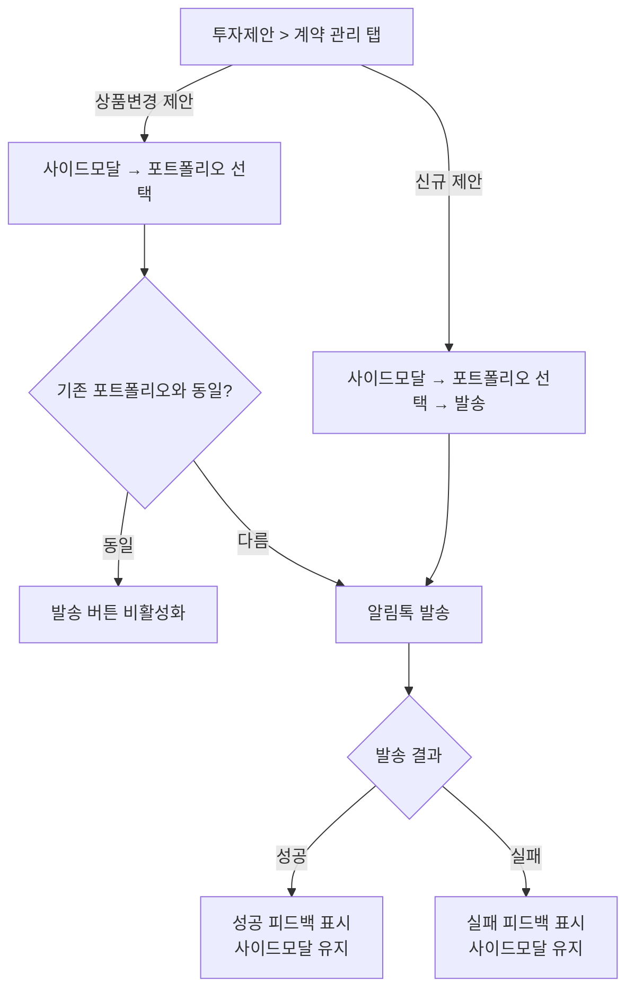

# 투자제안 알림톡 — 상품변경 지원

> 함께 작업: 1158 계약목록
>
> 인터뷰 상세: `INTERVIEW.md`

## 1. 사용자 스토리

> fa로서
>
> 계좌 유형별 신규·변경 제안 링크 발송을 한 화면에서 처리하고 싶다.
>
> 이를 통해 미결계약 상태의 포트폴리오에 변경 링크가 아닌 신규 링크를 잘못 보내는 실수를 방지할 수 있다.

## 2. 기능 요구사항

### 미결계약 UI 신설

- 계약 관리 탭에 미결계약 카드를 새로 표시해야 한다
- 미결계약 카드는 포트폴리오명, 계약 진행 시작일, 진행단계를 표시해야 한다 ([투자설계-투자제안.md §4.10](../../../policy/bw-fa/투자설계-투자제안.md#410-미결계약-포트폴리오명-표시-규칙) 참조)
- 모든 계좌유형 그룹을 항상 표시해야 한다
- 신규 제안 버튼 노출 조건:
  - IRP/ISA (단일계약): 계약·미결 모두 없을 때만 표시
  - 연금저축/종합위탁 (다중계약): 미결이 없을 때 표시 (기계약 존재 무관)
  - 미결계약이 존재하면 신규 제안 버튼 미노출 (계좌유형당 미결 1개 제한)
- 만료까지 남은 일수(D-N) 표시 (미구현)

### 상품변경 제안 진입

- 미결계약 카드와 기계약 카드 각각에 상품변경 제안을 시작할 수 있는 버튼이 있어야 한다
- 버튼 클릭 시 포트폴리오 선택 사이드모달이 열려야 한다
- 상품변경 제안 버튼 클릭하여 사이드모달 열면 현재 포트폴리오를 사이드모달 내에 표시해야 한다 ("현재 포트폴리오: {MP명}" — 기계약/미결계약 구분 없이 동일 문구)
- 해지가 진행중인 계약에는 상품변경 버튼이 노출되지 않아야 한다

### 알림톡 발송

- 포트폴리오를 선택하고 발송하면 알림톡이 전송되어야 한다
- 발송 시 해당 계약 또는 미결계약의 식별 정보가 함께 전달되어야 한다
- 발송 전 확인 다이얼로그를 표시해야 한다 — 신규 제안 시 "신규 포트폴리오 권유 링크를 발송하시겠습니까?", 상품변경 시 "변경 포트폴리오 권유 링크를 발송하시겠습니까?"
- 발송 성공 시 성공 피드백을 표시해야 한다
- 발송 성공 후 발송 이력이 갱신되어야 한다

### 오버뷰 계약 영역 보강

- 미결계약이 있는 계좌유형은 기계약이 없어도 오버뷰 계약 영역에 표시해야 한다
- 미결계약 표시 필드: 포트폴리오명, 계약 진행 시작일, 만료일(미구현)
- 기계약과 미결계약이 동시에 있는 계좌유형은 미결계약을 기계약보다 위에 표시해야 한다
- 계약 영역 타이틀("계약 관리") 클릭 시 투자제안 > 계약 관리 탭으로 이동해야 한다

## 3. 화면 흐름

### 3.1 구조 변경

투자제안 페이지의 탭 구조를 변경한다. 포트폴리오 실행 탭을 삭제하고, 계약 현황을 계약 관리 탭으로 재구성한다.

**투자제안 페이지 탭 변경**

| 기존 탭         | 변경            | 역할                                                           |
| --------------- | --------------- | -------------------------------------------------------------- |
| 포트폴리오 제안 | 포트폴리오 제안 | 변경 없음                                                      |
| 포트폴리오 실행 | ~~삭제~~        | 계약 채널 안내 → 계약 관리 탭 내 가이드북 링크로 대체          |
| 계약 현황       | **계약 관리**   | 계좌유형별 계약 관리 + 신규 제안·상품변경 + 발송 이력 (재구성) |

### 3.2 화면 네비게이션 다이어그램



### 3.3 계약 관리 탭 (투자제안 > 계약 관리)

```
┌───────────────────────────────────────────────────────────┐
│  [ 포트폴리오 제안 │ **계약 관리** ]                             │
├───────────────────────────────────────────────────────────┤
│                                                           │
│  베러웰스 앱 내 KB증권 연계 쿼터백 투자 서비스에 가입한               │
│  고객의 계약 정보가 표시됩니다.                                  │
│  각 증권사 별 상세 제안 방법은 가이드북을 참고해주세요.                │
│                                                           │
│  IRP · 자문                       [신규 제안]                │  * 기계약 없음, 미결 없음
│  최근 발송: 2026-04-01  포트폴리오A                            │
│                                                           │
│  ISA · 자문                                                │  * 기계약 있음, 미결 없음
│  최근 발송: 2026-03-15  포트폴리오B                            │
│  ┌─────────────────────────────────────────┐              │
│  │ [기계약카드] 포트폴리오C         [계약상태 배지] │              │
│  │ 계약 만료일 / 남은일수                       │              │
│  │ 투자원금 / 평가금액                         │              │
│  │ 수익금액 / 수익률                           │              │
│  │ 평가일시                                  │              │
│  │ 계약일 / 계약기간                           │              │
│  │ 증권사 / 운용계좌                           │              │
│  │ 수수료 유형 / 수수료율                       │              │
│  │ 수수료 출금 기관                            │              │
│  │ 수수료 출금 계좌                            │              │
│  │ 수수료 출금 주기 / 출금 예정일                 │              │
│  │                             [상품변경 제안] │              │
│  └─────────────────────────────────────────┘              │
│                                                           │
│  연금저축 · 일임                                             │  * 기계약 있음, 미결 있음
│  최근 발송: 2026-04-10  포트폴리오C                            │
│  ┌─────────────────────────────────────────┐              │
│  │ [계약진행중카드] 포트폴리오명       [계약 진행 중] │              │
│  │ 계약 진행 시작일                                │              │
│  │  진행단계                      [상품변경 제안]│              │
│  └─────────────────────────────────────────┘             │
│  ┌─────────────────────────────────────────┐             │
│  │ [기계약카드] 포트폴리오D        [계약상태 배지]  │              │
│  │ 계약 만료일 / 남은일수                       │              │
│  │ 투자원금 / 평가금액                          │              │
│  │ 수익금액 / 수익률                           │              │
│  │ 평가일시                                  │              │
│  │ 계약일 / 계약기간                           │              │
│  │ 증권사 / 운용계좌                           │              │
│  │ 수수료 유형 / 수수료율                       │              │
│  │ 수수료 출금 기관                            │              │
│  │ 수수료 출금 계좌                            │              │
│  │ 수수료 출금 주기 / 출금 예정일                 │              │
│  │                             [상품변경 제안]│              │
│  └─────────────────────────────────────────┘              │
│                                                          │
│  종합위탁 · 일임                    [신규 제안]                │  * 기계약 없음, 미결 없음, 발송이력 없음
│  ┌─────────────────────────────────────────┐             │
│  │              아직 정보가 없습니다.                   │             │
│  └─────────────────────────────────────────┘             │
│                                                           │
└───────────────────────────────────────────────────────────┘
```

> 계좌유형(IRP·자문 / ISA·자문 / 연금저축·일임 / 종합위탁·일임) 단위로 그룹핑.
>
> **모든 계좌유형 그룹을 항상 표시.**
>
> 신규 제안 버튼: IRP/ISA는 계약·미결 모두 없을 때만, 연금저축/종합위탁은 미결 없을 때 표시 (기계약 있어도 노출).
>
> 미결계약 존재 시 신규 제안 버튼 미노출 (계좌유형당 미결 1개 제한).
>
> 연금저축·종합위탁은 미결 + 기계약 동시 존재 가능.
>
> 최근 발송: 계좌유형당 1건 — 그룹 타이틀 바로 아래에 위치. 발송 이력이 없으면 표시하지 않음.

### 3.4 화면별 상세

#### 계약 관리 탭 — 가이드 문구

- 탭 상단에 안내 문구 표시:
  - 베러웰스 앱 내 KB증권 연계 쿼터백 투자 서비스에 가입한 고객의 계약 정보가 표시됩니다.
  - "각 증권사 별 상세 제안 방법은 [가이드북](https://guide.quarterback.co.kr/276b3f46-04d6-8066-8f95-cdf0d924cff0)을 참고해주세요."

#### 계약 관리 탭 — 계좌유형 그룹

- 그룹 소제목: 계좌유형·계약유형 (예: `IRP·자문`, `ISA·자문`, `연금저축·일임`, `종합위탁·일임`)
- 모든 계좌유형 그룹을 항상 표시
- 신규 제안 버튼 노출:
  - IRP/ISA (단일계약): 계약·미결 모두 없을 때만
  - 연금저축/종합위탁 (다중계약): 미결이 없을 때 (기계약 존재 무관)
- 그룹 내 카드 표시 순서: 미결계약 → 기계약
- 정보 없음 상태: 계약·미결·발송이력이 모두 없는 그룹은 empty state 카드 표시 ("아직 정보가 없습니다.")
- 다중계약(연금저축/종합위탁)에서 기계약 카드가 2개 이상일 때의 정렬 순서: **정책 미확정**

#### 계약 관리 탭 — 발송 이력

- **계좌유형당 1건** — 계좌유형 그룹의 가장 최근 발송 이력 1건 (신규 제안/상품변경 구분 없음)
- 이력 항목: 발송일, 포트폴리오명
- 표시 위치: 계좌유형 그룹 타이틀 바로 아래
- 발송 이력이 없으면 표시하지 않음

#### 계약 관리 탭 — 미결계약 카드

- 카드 구성 필드:

  | #   | 필드               | 내용                        | 비고                                                                                                              |
  | --- | ------------------ | --------------------------- | ----------------------------------------------------------------------------------------------------------------- |
  | 1   | 상태 표시          | `[계약 진행 중]` 배지 (회색) |                                                                                                                   |
  | 2   | 포트폴리오명       | MP명                        | [투자설계-투자제안.md §4.10](../../../policy/bw-fa/투자설계-투자제안.md#410-미결계약-포트폴리오명-표시-규칙) 참조 |
  | 3   | 계약 진행 시작일        | `YYYY-MM-DD`                |                                                                                                                   |
  | 4   | 진행단계 배지      | 고객 앱 계약 진행 단계 표시 | `progressStateCode` 기준. 상세는 [bw-is/투자제안.md](../../../policy/bw-is/투자제안.md#미결계약-진행-단계) 참조   |
  | 5   | 상품변경 제안 버튼 | 카드 하단 우측              | 클릭 시 포트폴리오 선택 사이드모달 오픈. 진행단계 무관 항상 노출                                                  |

- 만료일 관련 필드(D-N)는 이번 scope 제외. 백엔드 삭제 예정일 필드 제공 후 후속 작업.
- 미결계약이 백엔드에서 삭제(만료)된 경우 실시간 반영 불필요 — 다음 페이지 진입 시 자연스럽게 반영.

#### 계약 관리 탭 — 기계약 카드

- 기계약 카드 구성 필드: 포트폴리오명, 계약만료일(남은일수), 계약상태, 투자원금, 평가금액, 수익금액, 수익률, 계약일, 계약기간, 평가일시, 증권사, 운용계좌, 수수료 유형, 수수료율, 수수료 출금 기관, 수수료 출금 계좌, 수수료 출금 주기, 수수료 출금 예정일, 상품변경 제안 버튼
- 상품변경 제안 버튼: 카드 하단 배치, 클릭 시 포트폴리오 선택 사이드모달 오픈
- 각 필드의 값 포맷·표기 규칙은 [계약목록.md §4 테이블 컬럼 정의](../../../policy/bw-fa/계약목록.md#4-테이블-컬럼-정의) 참조

- 계약상태 배지 색상 규칙:

  | 상태 | 배지 색상 | 비고 |
  | --- | --- | --- |
  | 운용 중 | 초록색 (green) | |
  | 해지 진행 중 (수수료 계산 중, 출금 대기 중, 해지 대기 중) | 빨간색 (red) | `contractStatus`: 2231, 2234, 2235 |
  | 그 외 (입금 대기 중, 승인 대기 중, 매매 대기 중 등) | 노란색 (yellow) | |

- 해지완료 상태 계약은 카드 자체 미노출 — 백엔드에서 응답에서 제외 ([계약상태.md §KBS 계약 상태별 문구 및 연결 화면](../../../policy/bw-is/계약상태.md#kbs-계약-상태별-문구-및-연결-화면) 참조)
- 해지 진행중 상태 계약은 카드는 표시하되, 상품변경 제안 버튼은 표시하지 않음 ([계약상태.md §KBS 계약 상태별 문구 및 연결 화면](../../../policy/bw-is/계약상태.md#kbs-계약-상태별-문구-및-연결-화면) 참조)

#### 포트폴리오 선택 사이드모달 — 신규 제안·상품변경 공통 진입점

- 오픈 트리거: 신규 제안 버튼 또는 상품변경 제안 버튼
- 사이드모달 구성:
  - 상단:
    - 포트폴리오 목록: 해당 계좌유형에 맞는 MP만 필터링하여 표시
    - 현재 포트폴리오명 표시 (상품변경 시에만 표시, 신규 제안 시 숨김)
      - "현재 포트폴리오: {MP명}" — 기계약/미결계약 구분 없이 동일 문구 사용
    - 발송 대상 계약 컨텍스트 (계좌유형·계약유형)

  - 중단: 선택한 포트폴리오 상세 정보
  - 하단: **알림톡 발송** CTA 버튼 (버튼명: 권유 링크 발송)

- 버튼 활성화 조건:
  - 상품변경: 현재 선택한 포트폴리오가 기존 포트폴리오(기계약 운용 중 또는 미결계약 진행 중)와 다른 경우
  - 신규 제안: 포트폴리오 선택 시 활성화

#### 발송 결과 처리

- 성공 시
  - 성공 피드백 표시
  - 사이드모달 유지 (닫지 않음)
  - 계약 관리 탭의 계약 상세 API 재조회 (발송 이력 갱신)
- 실패 시
  - 실패 피드백 표시
  - 사이드모달 유지 — 재시도 횟수 제한 없음

### 3.5 오버뷰 — 계약 영역

#### 현재 상태 AS-IS

오버뷰 페이지의 계약 영역은 **기계약이 있는 계좌유형만** 표시한다.

#### 변경 내용 TO-BE

미결계약도 오버뷰 계약 영역에 표시한다.

| 항목          | 기존 AS-IS                 | 변경 TO-BE                                                  |
| ------------- | -------------------------- | ----------------------------------------------------------- |
| 표시 대상     | 기계약이 있는 계좌유형만   | 기계약 또는 미결계약이 있는 계좌유형                        |
| 미결계약 표시 | 없음                       | 별도 행 (기계약보다 위)                                     |
| 클릭 동작     | 타이틀 클릭 → 계약 현황 탭 | 타이틀 클릭 → 투자제안 > 계약 관리 탭 (개별 항목 클릭 없음) |

#### 미결계약 표시 필드

| 필드             | 설명                 | 비고                                                                                                              |
| ---------------- | -------------------- | ----------------------------------------------------------------------------------------------------------------- |
| 포트폴리오명     | MP명                 | [투자설계-투자제안.md §4.10](../../../policy/bw-fa/투자설계-투자제안.md#410-미결계약-포트폴리오명-표시-규칙) 참조 |
| 계약 진행 시작일      | PCT 생성 시점        | `YYYY-MM-DD`                                                                                                      |
| 만료일(남은일수) | PCT 삭제 예정일 기준 | (미구현) 백엔드 삭제 예정일 필드 제공 후 추가                                                                     |

#### 케이스별 동작

| 케이스                                | 표시 내용                          |
| ------------------------------------- | ---------------------------------- |
| 기계약만 있음                         | 기존과 동일 (기계약 1행)           |
| 미결계약만 있음                       | 미결계약 1행 (계좌유형 표시됨)     |
| 기계약 + 미결계약 (연금저축·종합위탁) | 미결계약 1행 → 기계약 1행 순서     |
| 계약·미결 모두 없음                   | 해당 계좌유형 미표시 (기존과 동일) |

## 4. 인수 조건

**미결계약 표시**

- [ ] 특정 계좌유형에 미결계약이 있으면, 해당 계좌유형 그룹 내에 미결계약 카드가 표시되어야 한다
- [ ] 계약 관리 탭의 미결계약 카드에 포트폴리오명, 계약 진행 시작일, 진행단계가 표시되어야 한다
- [ ] 모든 계좌유형 그룹이 항상 표시되어야 한다
- [ ] IRP/ISA에서 계약·미결 모두 없을 때 신규 제안 버튼이 표시되어야 한다
- [ ] 연금저축/종합위탁에서 미결이 없으면 기계약이 있어도 신규 제안 버튼이 표시되어야 한다
- [ ] 미결계약이 존재하는 그룹에는 신규 제안 버튼이 표시되지 않아야 한다
- [ ] 연금저축 또는 종합위탁에 미결계약과 기계약이 동시에 존재하면, 같은 계좌유형 그룹 내에 미결/기계약 카드가 각각 별도로 표시되어야 한다
- [ ] 미결계약 카드의 상품변경 버튼은 진행단계와 무관하게 항상 노출되어야 한다

**상품변경 진입**

- [ ] 상품변경 버튼을 클릭하면, "현재 포트폴리오: {MP명}"이 표시된 사이드모달이 열려야 한다 (기계약/미결계약 동일 문구)
- [ ] 해지가 진행중인 계약에는 상품변경 버튼이 표시되지 않아야 한다
- [ ] 현재 선택한 포트폴리오가 기존 포트폴리오(운용중/미결계약중)와 같은 경우, 발송 버튼이 비활성화되어야 한다
- [ ] 신규 제안 버튼 클릭 시 포트폴리오 선택 사이드모달이 열려야 한다
- [ ] 사이드모달의 포트폴리오 목록은 해당 계좌유형에 맞는 MP만 필터링하여 표시해야 한다

**발송 이력 표시**

- [ ] 발송 이력이 있는 계좌유형은 그룹 타이틀 바로 아래에 가장 최근 발송 이력 1건이 표시되어야 한다
- [ ] 발송 이력이 없는 계좌유형에는 발송 이력이 표시되지 않아야 한다
- [ ] 발송 이력은 신규 제안/상품변경 구분 없이 해당 계좌유형의 가장 최근 1건이어야 한다

**알림톡 발송**

- [ ] 포트폴리오를 선택하고 발송하면, 해당 계약 식별 정보가 포함된 알림톡이 전송되어야 한다
- [ ] 발송에 성공하면, 성공 피드백이 표시되어야 한다
- [ ] 발송에 실패하면, 실패 피드백이 표시되어야 한다
- [ ] 발송 성공 후, 계약 상세 API를 재조회하여 발송 이력이 갱신되어야 한다

**오버뷰 계약 영역**

- [ ] 미결계약이 있는 계좌유형은 기계약이 없어도 오버뷰 계약 영역에 표시되어야 한다
- [ ] 오버뷰의 미결계약 항목에 포트폴리오명, 계약 진행 시작일이 표시되어야 한다
- [ ] 미결계약 포트폴리오명 표시 규칙에 따라 포트폴리오명이 표시되어야 한다 ([투자설계-투자제안.md §4.10](../../../policy/bw-fa/투자설계-투자제안.md#410-미결계약-포트폴리오명-표시-규칙) 참조)
- [ ] 기계약과 미결계약이 동시에 있는 계좌유형은 미결계약 행이 기계약 행보다 위에 표시되어야 한다
- [ ] 계약 영역 타이틀("계약 관리") 클릭 시 투자제안 > 계약 관리 탭으로 이동해야 한다
- [ ] 기계약도 미결계약도 없는 계좌유형은 오버뷰에 표시되지 않아야 한다

**기존 동작 보호**

- [ ] 포트폴리오 제안 탭의 기존 기능이 변경되지 않아야 한다

## 5. 제약 조건 체크리스트

- [ ] 정책서에 개발 코드·API 엔드포인트·요청/응답 형식 포함하지 않았는가
- [ ] PII·고객 데이터가 포함되지 않았는가
- [ ] 관련 기존 정책서와 충돌하는 내용은 없는가
- [ ] 미결계약 전용 API 신규 스펙 백엔드 협의 완료 여부 확인
- [ ] 미결계약 삭제 예정일 필드 제공 일정 백엔드 확인 (D-N 표시 후속 작업)
- [ ] 다중계약(연금저축/종합위탁) 기계약 카드 정렬 순서 정책 확정 필요
- [ ] 미결계약 포트폴리오명 필드 확인 — `portfolioName`(FA 화면·알림톡 노출용)과 `portfolioAltName`(쿼터백 앱 내 노출용)이 다른 값. FA 화면에서는 `portfolioName`을 사용해야 하며, 백엔드에서 해당 필드가 정상 제공되는지 확인 필요
